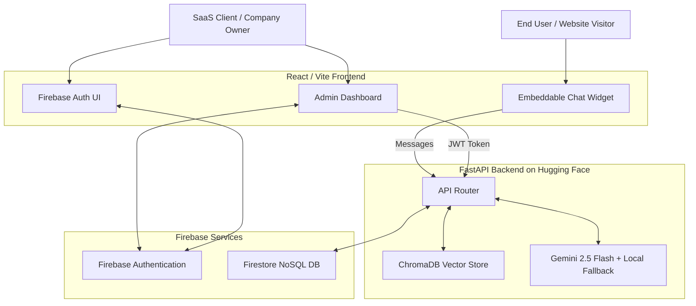

# 🚀 Agent: Multi-Tenant AI Chatbot SaaS Platform

Welcome to **Agent** — an enterprise-grade, highly scalable SaaS platform that allows users to create, train, and deploy custom AI chatbots for their companies. 

This platform was built with a modern, decoupled architecture leveraging React, FastAPI, Firebase, and Hugging Face.

---

## 🏗️ System Architecture

Our platform is divided into a blazing-fast Frontend and an ultra-secure, AI-powered Backend.

---

## ✨ Key Features We Built

### 1. 🏢 Multi-Tenant SaaS Engine
- **Isolated Environments**: Users can create multiple distinct chatbots.
- **Data Segregation**: We engineered ChromaDB to dynamically spin up separate vector spaces (`bot_{id}`) for every single chatbot, ensuring Company A's data never leaks to Company B.
- **Firestore Database**: Complete persistence of all companies, users, and chatbot configurations using Google Cloud Firestore.

### 2. 🧠 Advanced 4-Tier LLM Fallback System
We built an incredibly resilient inference engine that guarantees 100% uptime:
1. **Tier 1**: Google Gemini 2.5 Flash (Primary Key)
2. **Tier 2**: Google Gemini 2.5 Flash (Backup Key 1)
3. **Tier 3**: Google Gemini 2.5 Flash (Backup Key 2)
4. **Tier 4**: `Qwen/Qwen2.5-1.5B-Instruct` (Local CPU Fallback) — *If Google's APIs completely go down, our server automatically loads a lightweight, offline model to ensure the chatbots never stop answering questions!*

### 3. 🔐 Enterprise Security
- **Firebase Auth**: Fully managed authentication (Email/Password & Google OAuth).
- **JWT Verification**: The Python backend uses the Firebase Admin SDK to decode and cryptographically verify every single request before allowing access to the vector store.
- **Guardrails**: Built-in prompt injection defense to prevent users from jailbreaking the bots or asking harmful questions.

### 4. 📚 Intelligent RAG (Retrieval-Augmented Generation)
- **PDF Knowledge Ingestion**: Upload any PDF directly through the dashboard.
- **Smart Chunking**: Automatically processes documents, embeds the text using `sentence-transformers`, and stores them natively in ChromaDB.
- **Context Injection**: Dynamically injects only the most relevant snippets of information directly into the AI's prompt.

### 5. 💻 Embeddable Chat Widget
- Every chatbot generated on the dashboard instantly outputs an **Embed Code**.
- This code can be pasted directly into any website to instantly inject the AI assistant.

---

## 🛠️ Technology Stack

| Component | Technology Used | Purpose |
| --- | --- | --- |
| **Frontend** | React, Vite, Tailwind CSS | Fast, beautiful, and responsive SaaS dashboard. |
| **Backend** | Python, FastAPI | High-performance async API server. |
| **Database** | Firebase Firestore | Highly scalable NoSQL document storage. |
| **Auth** | Firebase Authentication | Secure JWT-based user login and management. |
| **Vector DB** | ChromaDB | Local, blazing-fast similarity search for RAG. |
| **AI Models** | Google GenAI SDK (`gemini-2.5-flash`) & Hugging Face `transformers` | LLM text generation and fallback handling. |
| **Hosting** | Hugging Face Spaces | Free, scalable Docker deployment. |

---

## 🚀 Getting Started

### Prerequisites
- Node.js (v18+)
- Python 3.10+
- Firebase Project (with Firestore and Auth enabled)

### Local Development

**1. Clone the repository**
\`\`\`bash
git clone https://github.com/kanha077/company-chatbot-platform.git
cd company-chatbot-platform
\`\`\`

**2. Setup the Frontend**
\`\`\`bash
cd frontend
npm install --legacy-peer-deps
npm run dev
\`\`\`
*Note: Ensure your `.env` file is populated with your Firebase Web Config.*

**3. Setup the Backend**
\`\`\`bash
cd backend
python -m venv .venv
source .venv/bin/activate  # (or .venv\Scripts\activate on Windows)
pip install -r requirements.txt
python app.py
\`\`\`
*Note: Ensure your `serviceAccountKey.json` is placed in the `backend` folder for Firebase Admin access.*

---

## 🚢 Deployment

The backend is fully configured to deploy automatically to **Hugging Face Spaces**. 
Simply run the included deployment script:
\`\`\`bash
python deploy_to_hf.py
\`\`\`
*Make sure to add your `FIREBASE_SERVICE_ACCOUNT_JSON` as a Secret in your Hugging Face space settings!*

---
*Built with ❤️ for production-grade AI.*
